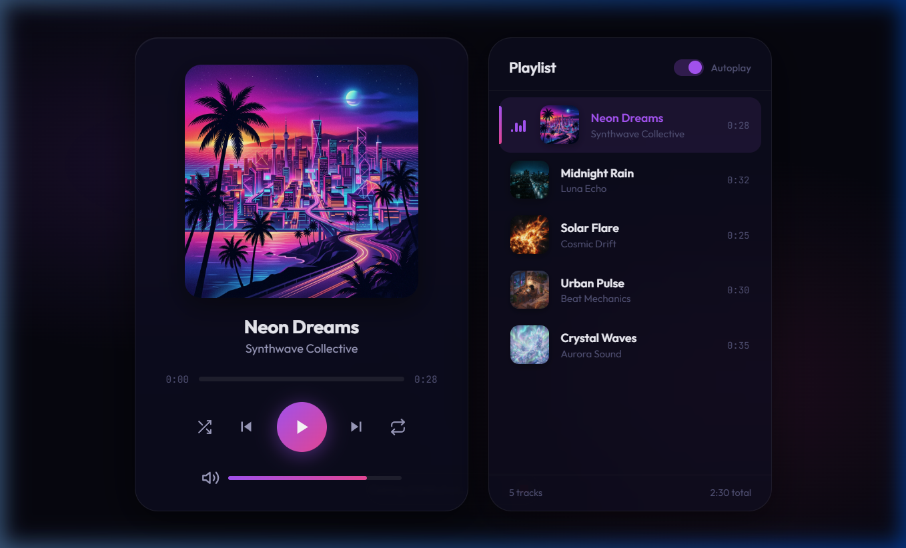
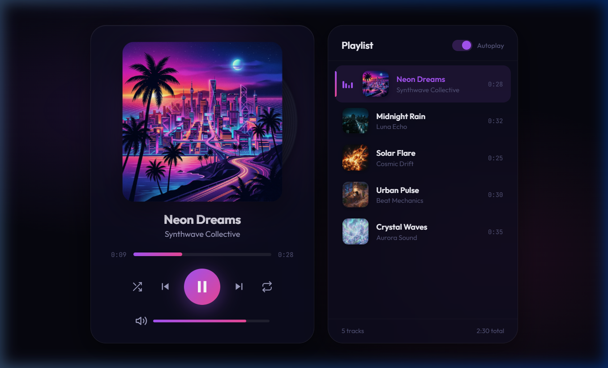

# ✦ SoundScape — Premium Web Music Player ✦

SoundScape is a premium, web-based music player designed with a modern glassmorphic interface, dynamic ambient glow, active rotating vinyl disk visualization, responsive layouts, and full keyboard accessibility. 

---

## 🔗 Live Link

Access the live deployment of the SoundScape Music Player here:
> 🚀 **Live Demo:** **https://prismatic-piroshki-28b7d8.netlify.app/**

---

## 📸 Project Screenshots

### 1. Default State
The initial view displaying the glassmorphic player card, track list panel, default Synthwave Collective track cover, volume slider, and initial player controls.


### 2. Playing State
An active playback session showcasing the rotating vinyl disc peeking from behind the album art, dynamic audio wave visualizer (EQ bars) animating next to the active playlist item, real-time seek progress, and customized ambient background glow coordinates matching the vibe.


---

## ✨ Features

- **Ambient Visual Design:** A soft, glowing dark-mode background featuring dynamic color gradients that coordinate with the current track artwork.
- **Glassmorphic UI Card:** Semi-transparent, blur-filtered container borders with high-contrast active buttons, sleek sliders, and soft drop shadows.
- **Dynamic Vinyl Disc Visualization:** A virtual vinyl record element that smoothly peeks out from the album cover container and rotates continuously when playback is active.
- **Built-in Audio Synthesizer:** Programmatic WAV audio generation built directly into the client-side JavaScript. Creates 5 unique tracks with rich harmonics and decay on-the-fly (no external audio file dependencies needed):
  1. *Neon Dreams* — Synthwave Collective (Bright arpeggio in C Major)
  2. *Midnight Rain* — Luna Echo (Slow, atmospheric pad notes)
  3. *Solar Flare* — Cosmic Drift (Energetic ascending patterns)
  4. *Urban Pulse* — Beat Mechanics (Rhythmic bass-driven beat)
  5. *Crystal Waves* — Aurora Sound (Ethereal high-melody synth)
- **Comprehensive Playback Controls:**
  - Standard Play, Pause, Next, and Previous operations.
  - Interactive click-to-seek playback progress bar and drag/touch volume bar.
  - Shuffle, Repeat (modes: Off, Repeat All, Repeat One), and Autoplay Next Track options.
  - Playlist sidebar displaying track durations, titles, artists, and live animated EQ wave elements next to the playing song.
- **A11y & Keyboard Support:** Support for key bindings to control player functions:
  - `Space`: Play / Pause playback
  - `ArrowRight`: Seek forward 5 seconds
  - `ArrowLeft`: Seek backward 5 seconds
  - `ArrowUp`: Increase volume by 5%
  - `ArrowDown`: Decrease volume by 5%
  - `N` / `n`: Skip to next track
  - `P` / `p`: Go to previous track
  - `M` / `m`: Mute or unmute volume
  - `S` / `s`: Toggle Shuffle mode
  - `R` / `r`: Toggle Repeat mode (Off → Repeat All → Repeat One)
- **Responsive Layout:** Adaptive styling using CSS Grid and Flexbox that transitions smoothly from large desktop viewports to mobile phones.

---

## 📁 Project Structure

```text
music-player/
├── index.html          # Semantic HTML structure, player panels, and svg icons
├── index.css           # Styling tokens, animations (spin, EQ rise), glassmorphism, and layouts
├── player.js           # Audio generation, playlist states, keyboard listeners, and progress loops
└── images/             # Documentation screenshots
    ├── screenshot_default.png
    └── screenshot_playing.png
```

---

## 🛠️ Technologies Used

- **HTML5:** Semantic architecture, accessible controls (`role="slider"`, `tabindex`), and scalable inline SVGs.
- **CSS3:** Flexible layouts, glassmorphic backdrops, glowing filters, custom scrollbars, keyframe animation variables, and media queries.
- **JavaScript (ES6+):** Pure vanilla JS, programmatic binary PCM synthesis, raw WAV encoding (`RIFF`/`WAVE` data view headers), Event Listeners, and requestAnimationFrame loops.

---

## 🚀 How to Run Locally

Because the audio files are generated as Blob URLs programmatically, you should host the files using a local HTTP server for optimal browser performance.

### Option 1: Python HTTP Server (Recommended)
Open your terminal inside the `music-player` directory and run:
```bash
python -m http.server 8000
```
Then visit [http://localhost:8000](http://localhost:8000) in your web browser.

### Option 2: Node.js (npx)
Using Node.js, run the following command in the project root:
```bash
npx http-server -p 8000
```
Then visit [http://localhost:8000](http://localhost:8000) in your web browser.
